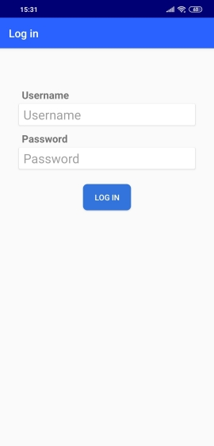
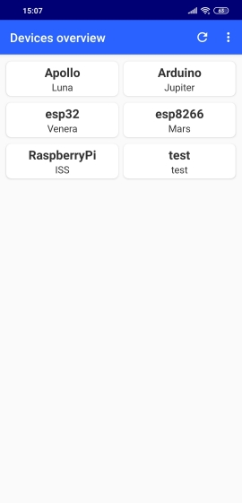
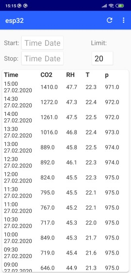

# Projekt IoT platforma
#### Seminar iz načrtovanja in razvoja programske opreme v telekomunikacijah 2020
---
## Mobilna aplikacija
Mobilna aplikacija deluje kot "viewer" in zato omogoča le funkcionalnosti prijave in pregledovanja naprav ter meritev.\
Dodajanje/spreminjanje/odstranjevanje uporabnikov, naprav in meritev je mogoče le preko spletnega vmesnika.

### Screenshots

